# Información para desarrollo y arquitectura

## Flujo de procesos propuesto (TO-BE)

```plantuml
@startuml
title Flujo de procesos propuesto (TO-BE)\nPlataforma de Historias Clínicas y Derivación Universitaria

skinparam shadowing false
skinparam roundcorner 12
skinparam activityBorderColor #666666
skinparam activityBackgroundColor #F8F8F8
skinparam activityDiamondBackgroundColor #FFFFFF
skinparam activityDiamondBorderColor #666666
skinparam ArrowColor #666666
skinparam DefaultTextAlignment center

start

partition "Estudiante" {
  :Solicita atención o se presenta\nen el servicio médico;
}

partition "Personal Administrativo" {
  :Busca al estudiante por carnet,\ncódigo o nombre;
}

if (¿El estudiante ya existe?) then (Sí)

  partition "Personal Administrativo" {
    :Valida y actualiza datos si hace falta;
  }

else (No)

  partition "Personal Administrativo" {
    :Crea registro del estudiante;
    :Carga datos base:\n- Carnet\n- Código de registro\n- Nombre completo\n- Edad\n- Carrera\n- Peso;
  }

endif

partition "Personal Administrativo" {
  :Crea o registra cita/atención inicial;
  :Asocia la atención al estudiante;
}

partition "Médico de revisión estudiantil" {
  :Abre la ficha digital del estudiante;
  :Consulta historial previo\nsi existe;
  :Realiza atención inicial;
  :Crea nueva historia clínica o nueva atención;
  :Registra hallazgos clínicos,\ndiagnóstico y observaciones;
  :Adjunta examen de química sanguínea,\nfoto, escaneo o documento clínico;
}

if (¿Requiere derivación a especialidad?) then (Sí)

  partition "Médico de revisión estudiantil" {
    :Registra derivación estructurada;
    :Selecciona especialidad destino:\n- Dermatología\n- Oftalmología\n- Medicina Interna\n- Urología\n- Ginecología;
    :Registra motivo de consulta;
    :Registra comentario clínico\nde derivación;
  }

  partition "Personal Administrativo" {
    :Crea o registra la atención\nde especialidad;
  }

  partition "Médico especialista" {
    :Abre la ficha del paciente;
    :Consulta historial clínico,\natenciones previas, derivación\ny adjuntos;
    :Realiza atención especializada;
    :Registra nueva evolución clínica;
    :Registra diagnóstico,\nconducta y seguimiento;
    :Adjunta nuevos documentos,\nfotos o exámenes si aplica;
  }

else (No)

  partition "Médico de revisión estudiantil" {
    :Cierra la atención inicial;
  }

endif

partition "Sistema" {
  :Consolida historial clínico\ncentralizado del paciente;
  :Mantiene trazabilidad de:\n- atenciones\n- diagnósticos\n- derivaciones\n- adjuntos\n- fechas\n- médico responsable;
}

partition "Médicos y Administrativos" {
  :Buscan pacientes e historial;
  :Filtran por fecha, diagnóstico,\nenfermedad, derivación,\nespecialidad o médico;
  :Consultan pacientes atendidos\ny fecha de atención;
  :Generan reportes rápidos y filtrados;
}

partition "Reportes" {
  :Pacientes atendidos hoy;
  :Pacientes atendidos por fecha;
  :Diagnósticos registrados;
  :Derivaciones realizadas;
  :Cumplimiento de consulta obligatoria;
  :Reportes por carrera, edad,\npeso y otros filtros;
}

stop
@enduml
```



## Decisión arquitectónica

El núcleo transaccional es la historia clínica longitudinal, no la agenda. Una cita es un registro operativo que puede terminar en atención, cancelación o inasistencia. Toda atención, documento, diagnóstico y derivación debe apuntar al paciente y conservar autor, fecha, estado y auditoría.

## Dominios principales

| Dominio | Responsabilidad |
|---|---|
| identity | Usuarios, roles y permisos. |
| patients | Perfil del estudiante, carnet, código de registro, carrera y datos de contacto. |
| appointments | Solicitudes, cupos, citas y asistencia; siempre para atención inicial salvo derivación. |
| clinical | Historia clínica, atenciones, evoluciones, diagnósticos, etiquetas, mediciones e indicaciones. |
| documents | Archivos privados, metadatos, clasificación de estudio y relación con la atención. |
| referrals | Derivaciones, especialidad destino, motivo, comentario, asignación y ciclo de vida. |
| reporting | Consultas agregadas, accesos rápidos, exportaciones y cumplimiento institucional. |
| audit | Registro inmutable de accesos, modificaciones y exportaciones. |

## Modelo de datos mínimo

- `Patient`: id, carnet único, códigoRegistro único, nombres, fechaNacimiento, carrera, contacto y estado.
- `ClinicalHistory`: id, patientId y metadatos de creación; no contiene un resumen editable como única fuente de verdad.
- `ClinicalEncounter`: id, historyId, appointmentId opcional, doctorId, tipo (`INITIAL` o `SPECIALTY`), fecha, motivo, evaluación base, estado. **Nota:** Los encuentros tipo `SPECIALTY` se extienden con entidades o campos categóricos específicos por especialidad (ej. `OphthalmologyEncounterData`, `GynecologyEncounterData`) para generar reportes estructurados precisos.
- `Diagnosis`: id, encounterId, catálogo/etiqueta normalizada, descripción y estado.
- `Measurement`: id, encounterId, tipo, valor, unidad y fecha; peso es histórico, no un campo que se pisa.
- `ClinicalDocument`: id, patientId, encounterId opcional, almacenamiento privado, tipo, fechaEstudio, descripción, etiquetas y autor.
- `Referral`: id, encounterId origen, patientId, especialidad destino, motivo, comentario, estado, especialista asignado y fechas.
- `Appointment`: id, patientId, cupoId, tipo (`INITIAL`/`REFERRAL`), estado y referencia a derivación cuando aplique.
- `AuditEvent`: actor, acción, recurso, fecha, contexto mínimo y resultado.

## Estados recomendados

| Recurso | Estados |
|---|---|
| Cita | `REQUESTED`, `SCHEDULED`, `CANCELLED`, `NO_SHOW`, `ATTENDED` |
| Atención | `DRAFT`, `CLOSED`, `AMENDED` |
| Derivación | `PENDING_ASSIGNMENT`, `ASSIGNED`, `IN_PROGRESS`, `RETURNED`, `CLOSED`, `CANCELLED` |
| Documento | `PROCESSING`, `AVAILABLE`, `REJECTED` |

## API sugerida

```text
GET/POST   /patients
GET/PATCH  /patients/{id}
GET        /patients/{id}/history
POST       /patients/{id}/encounters
PATCH      /encounters/{id}
POST       /encounters/{id}/documents
POST       /encounters/{id}/referrals
GET/PATCH  /referrals/{id}
GET        /doctors/me/patients?diagnosis=&from=&to=&career=&referralStatus=
GET        /reports/daily-attended
GET        /reports/clinical
POST       /reports/exports
```

## Seguridad y adjuntos

- Usar autorización por rol y relación clínica: el médico no navega pacientes ajenos.
- Guardar archivos fuera de la base de datos, en almacenamiento privado; la BD conserva referencia y metadatos.
- Validar MIME, tamaño, antivirus si está disponible y usar URL temporal para descarga/previsualización.
- No incluir adjuntos ni texto clínico en logs de aplicación.
- Registrar lectura de historia, descarga de documentos, creación de adenda y exportación de reporte.

## Consultas e índices prioritarios

- Índices únicos para carnet y código de registro.
- Índices por `patientId + fecha` en atención y documentos.
- Índices por `doctorId + fecha`, `specialty + status` en derivaciones.
- Índices para filtros de reporte por fecha, médico, especialidad, diagnóstico/etiqueta y carrera.

## Pruebas críticas

- Duplicados de carnet/código y actualización administrativa segura.
- Permisos al abrir historia o descargar un adjunto.
- Persistencia de una evolución anterior al crear otra.
- Derivación incompleta o dirigida a especialidad no habilitada.
- Relación consistente entre cita atendida y atención clínica cerrada.
- Filtros combinados de “Mis pacientes” y reportes diarios.
- Auditoría de cambios clínicos y exportaciones.
